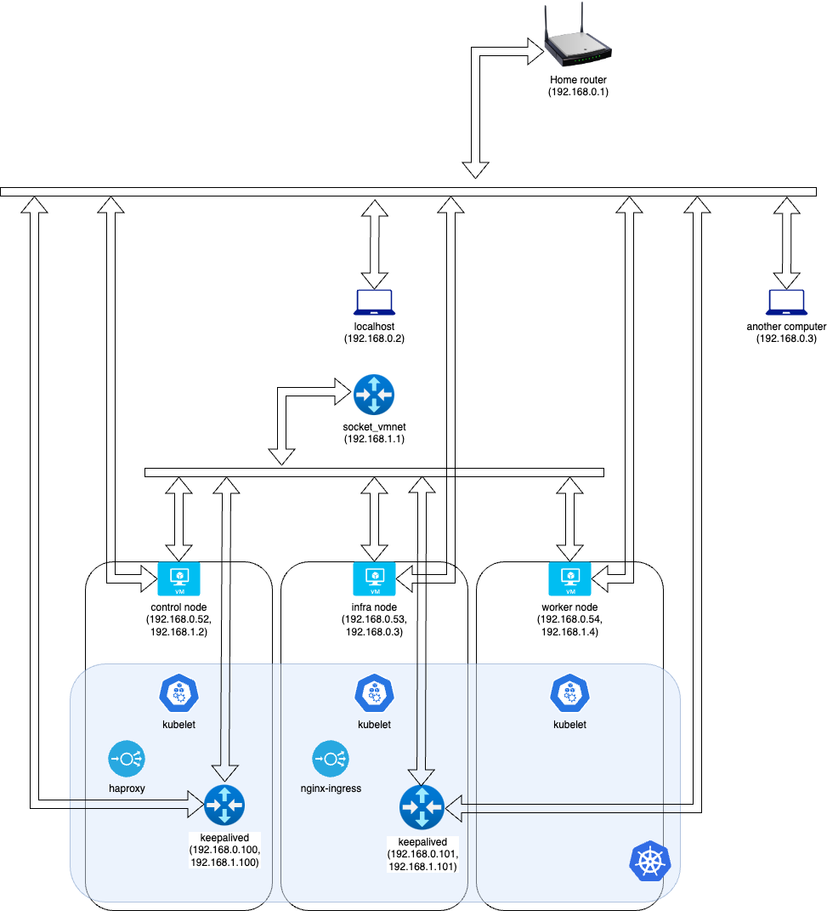

# Kubernetes Cluster in my Home Network

My cluster configuration for a multi-node Kubernetes cluster spread across multiple physical computers is here.
I followed the instructions from the [official documentation of Kubernetes](https://kubernetes.io/docs/setup/production-environment/) as I built the cluster.

## Specifications

| Item                         | Value   |
| ---------------------------- | ------- |
| Hypervisor                   | limactl |
| Hypervisor version           | 0.20.0  |
| Guest OS                     | Ubuntu  |
| Guest OS version             | 22.04   |
| Guest CPU architecture       | aarch64 |
| Kubernetes version           | 1.29.0  |
| Container runtime            | CRIO    |
| Container runtime version    | 1.28    |
| Container networking         | Calico  |
| Container networking version | 3.27.0  |
| Ingress controller           | Nginx   |
| Ingress controller version   | 3.4.3   |

## Requirements

- Ansible

## Installation

1. Change the variables in the inventory file at [ansible/inventory.yaml](./ansible/inventory.yaml).
2. Run `./bootstrap.sh`.
