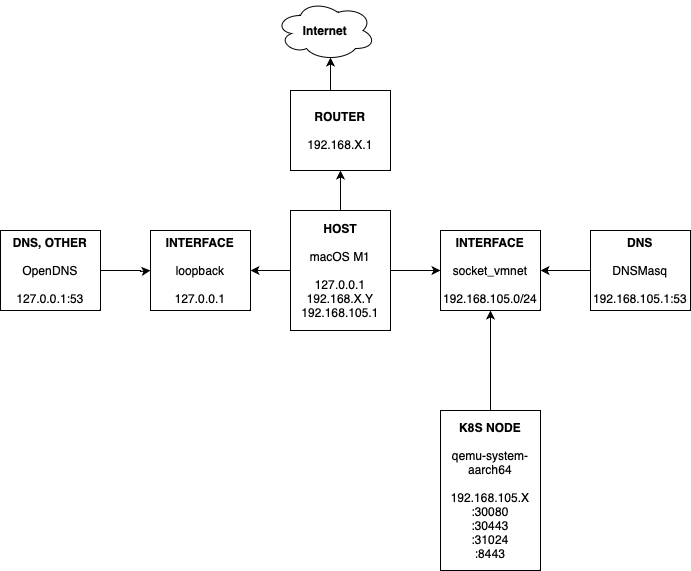

# Kubernetes Cluster in my Home Network

This is my cluster configuration: single node, Minikube-flavoured, running in a macOS host with
M1 (ARM-based CPU).

## Requirements

Ansible

## Installation

Run `./bootstrap.sh` and it will install all needed software and start the following host services:

- `socket_vmnet`, so that the QEMU VMs can have their own subnet.
- `dnsmasq`, so that the QEMU VMs can relay DNS requests to the host, as well as letting the host reach the Ingresses.

## Limitations

- Only tested for macOS.

- A DNSMasq has to run in the host because if there is nothing listening to 192.168.105.1:53/UDP,
  then the QEMU VMs will not be able to resolve internet addresses.

- Do not use the **Minikube Ingress** addon, otherwise you'll get stuck in a redirect loop when visiting
  your app's websites. This is why I used the HAProxy ingress controller instead.

- ARM64 images can only run. Minikube doesn't use emulation when it uses QEMU.
  Most of Minikube's addons will not work because of this.

## Troubleshooting

### `nslookup apps.homenet` fails in macOS

This is because we are not adding the entries to /etc/resolv.conf. This file is usually managed by 3rd party DNS managers,
so any changes here might disappear. Use `dscacheutil -q host -a name apps.homenet` instead. `curl` and most of the
programs in macOS will also work because they'll use the file we create at /etc/resolver/*.
