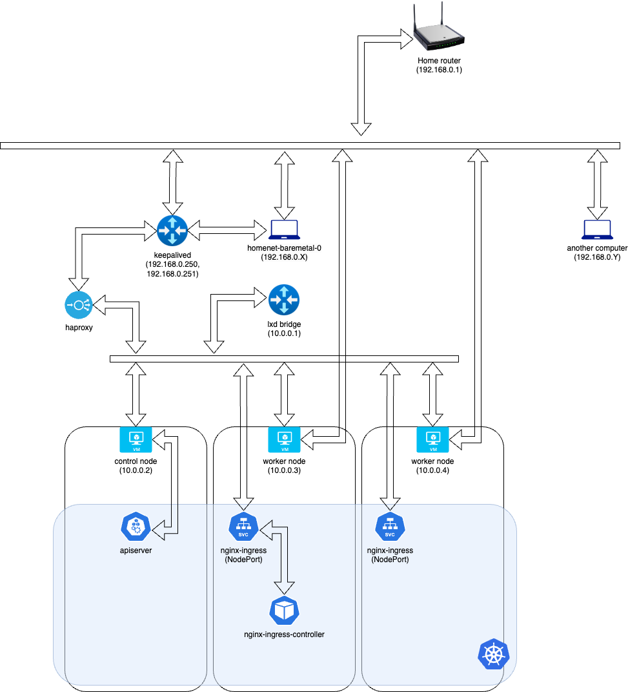

# Kubernetes Cluster in my Home Network

My cluster configuration for a multi-node Kubernetes cluster spread across multiple physical computers is here.
I followed the instructions from the [official documentation of Kubernetes](https://kubernetes.io/docs/setup/production-environment/) as I built the cluster.

## Specifications

| Item                         | Value   |
| ---------------------------- | ------- |
| Hypervisor                   | LXD     |
| Hypervisor version           | 0.20.0  |
| Guest OS                     | Ubuntu  |
| Guest OS version             | 22.04   |
| Guest CPU architecture       | aarch64 |
| Kubernetes version           | 1.29.0  |
| Container runtime            | CRIO    |
| Container runtime version    | 1.29    |
| Container networking         | Calico  |
| Container networking version | 3.27.0  |
| Ingress controller           | Nginx   |
| Ingress controller version   | 3.4.3   |

## Requirements

- Python 3
- Kubernetes CLI (`kubectl`)
- Helm
- Physical hosts
  - SSH server
  - Disable automatic suspend or shutdown (e.g. for laptops, when the lid is closed).
  - Disable swap
- Home router DHCP should exclude the virtual IPs for the Kubernetes API server and ingress.

## Installation

1. Change the variables in the inventory file at [ansible/inventory.yaml](./ansible/inventory.yaml).
2. Run `./bootstrap.sh`.
3. When the `vault-0` pod goes up in the `vault` namespace, connect to the pod with a shell and run the following
   - `vault operator init` and make sure to store the output in a secure place.
   - `vault operator unseal <key>` with three of the keys shown in the output of the previous command.

## Issues

1. LXC vms are difficult to assign external IPs. Need to find a way if the host network interface can be bridged,
  or if downgrading to LXC containers will help. This blocks static manifests and having nodes in different physical hosts.
2. Rate limits with the Docker public registry may prevent a full reinstall of the cluster.
  Consider using mirroring like https://docs.gitlab.com/ee/user/packages/dependency_proxy/,
  or change the image URLs to other public registries.
3. Dex, ArgoCD, and Grafana needs the External secrets operator so it can bootstrap the GitHub oauth secrets.
4. Certmanager cluster issuer might not bootstrap if controller is not available.
5. Vault still needs a manual unseal step.
6. Vault becomes unsealead on every pod restart.
